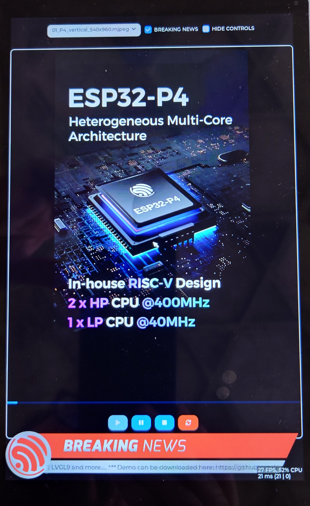

# Simple LVGL Player

This is a display + LVGL9 graphics library example.
Play mjpeg wideo from SD card.



## Build a flash

```
idf.py -p COMx flash monitor
```

## Usage

Save `*.mjpeg` video files into `root` on SD card. You can select video file and play it.

## USB

- You can connect USB mouse to control it by mouse cursor. For disable USB mouse set `APP_SUPPORT_USB_MOUSE` to zero.
- USB keyboard is not working right now.

## Create M-JPEG video

Create video without audio:
```
.\ffmpeg.exe -i input_video.mp4 -vcodec mjpeg -q:v 2 -vf "scale=800:450" -an output_video.mjpeg
```
